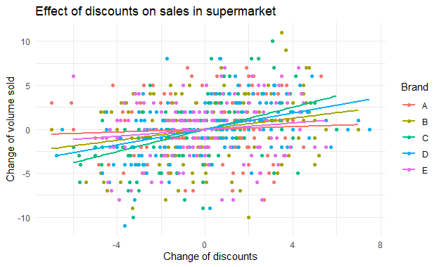
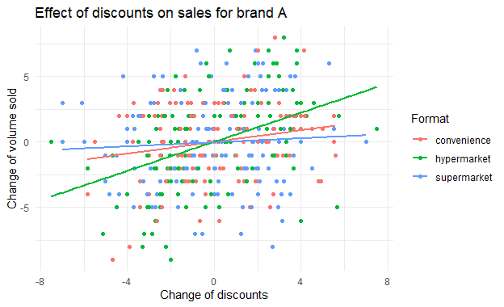
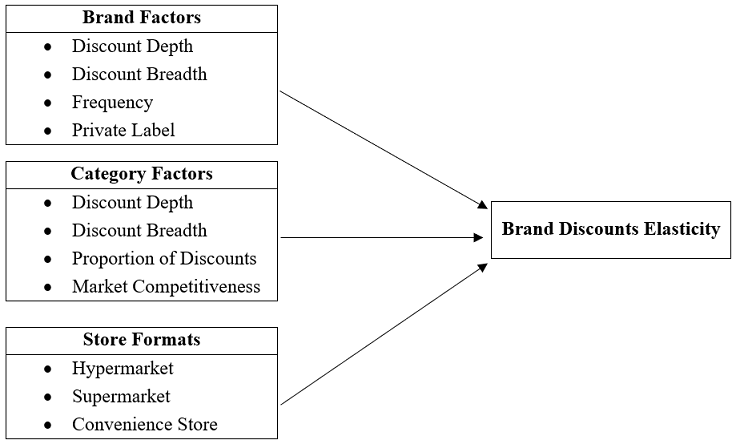
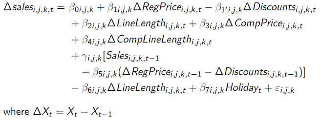
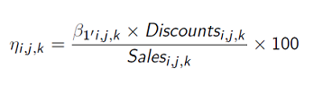
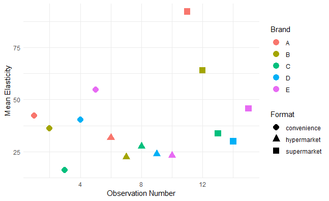
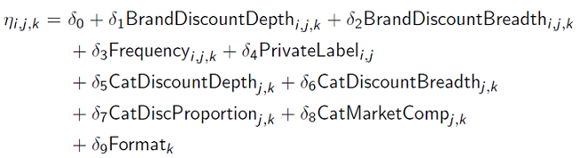

# When Do Discounts Matter? An Investigation of Potential Drivers of Discounts Elasticities Across Brands, Categories and Store Formats

### Author:
Tanetpong (Ned) Choungprayoon

## Abstract:
Most quantitative research papers model the effect of price promotions as the effect of changes in the final retail price while consumer behavior research suggests the potential framing phenomena in which customers can evaluate retail price and discounts differently. By taking this behavioral assumption in the sales-response model, we can estimate the discounts’ elasticities apart from price elasticities and investigate its systematic drivers from brand factors, category factors and store formats using second-stage regression. Using detailed scanner data from a membership database of an established grocery retailer across 28 categories and three formats, we found that discounts are most effective in a hypermarket format followed by a supermarket and a convenience store. The elasticities are more responsive to categories with higher dependency on discounts and fewer unique items promoted. While the average size of discounts in the category is insignificant, the brand’s size of discounts is positively influential to the discounts elasticity. Yet, offering discounts too often can decrease its discounts’ elasticities as well.

## Overview
The purpose of this repository is to publish the empirical research project conducted as part of my doctoral dissertation and to make the analysis part (with R) accessible, potentially inspiring further study. [The slides related to this study](https://github.com/tanetpongc/discountdeterminants/blob/95bcba3600df41998e394ced775a3bf51d228284/slide_deck/Slides_discountdeterminants.pdf) are also available in this repository. The empirical data is obtained from the retailer and stored via **AWS** and retrieve using (Postgre) **SQL**. This project is supported by Torsten Söderbergs Stiftelse.

`slide_deck` contains the most updated slides

`data` contains *df.csv* which is simulated data, similar to our data structure (i.e. scanner data), used for the walkthrough and *Simulate_Data.R* illustrating how data is simulated

`analysis` contains R code used for first-stage analysis (*firststage.R*) and second-stage analysis (*secondstage.R*)

`gen` contains example of results generated from first-stage analysis (*df_firststage.csv*) subsequently used for second-stage analysis

`img` contains visualization used in the walkthrough


## Walkthrough with simulated data
### Required package
For this project, we mainly use `data.table` for data aggregation and `ggplot2` for visualization. Honestly, most of the work involves data transformation and operationalization (i.e., transforming customer scanner data into brand, category and store-format data)

<details>
  <summary>Load required package</summary>

```R
library(data.table)
library(ggplot2)
```
</details>

### The data
**Setting**: We simulated scanner data from 300 customers shopping across formats (hypermarket, supermarket and conveniece store) imposing positive relationship between discounts and quantity sold and negative relationship between regular price and quantity sold. For simplicity, we walkthrough showing example of one category (category *z*). In category *z*, there are 5 brands available including "Brand A", "Brand B", "Brand C", "Brand D" and "Brand E".
<details>
  <summary>Import data</summary>

```R
df <- fread("../data/df.csv")
```
</details>

| Variable        | Description                                                  |
|---------------|------------------------------------------------------------|
| cust    | Customer id                                 |
| week_nr| Week number |
| spend | Total money spent                   |
| brand | Brand purchased              |
| format | Store format                     |
| category| Category z                             |
| regprice |Regular prices (list price) |
| discount| Discounts offered |
| quantity| Quantity purchased |
| holiday | = 1 if week_nr is holiday, otherwise  0|


### Data transformation
As we are interested in aggregate aspect (effectiveness of brands' discounts and potential systematic determinants from brand factor, category factor and store format), we need to transform by aggregating and operationalizing relevant variables.

<details>
  <summary>Generate (market-weighted average) brand variables across store formats</summary>

```R
df[, finalspending := regprice - discount]
df[, regpriceperunit := regprice/quantity]
df[, finalpriceperunit := finalspending /quantity]
df[, discountperunit :=  discount/quantity]

# Calculate weekly sales by brand
weeklysalesbybrand <- df[, .(totalsales = sum(quantity), LL = .N), by = .(week_nr,holiday, brand, format)]
  #LL can be calculated by uniqueN(product_id) to count distinct product id

# Merge df_complete with weeklysalesbybrand and calculate weights
df_weightcalc <- merge(df, weeklysalesbybrand, by = c("week_nr","holiday", "brand", "format"))
df_weightcalc[, wp := quantity/totalsales]

# Calculate weighted averages
df_weightcalc[, avgregpriceperunit := regpriceperunit * wp]
df_weightcalc[, avgfinalprice := finalpriceperunit * wp]
df_weightcalc[, avgdiscount := discountperunit * wp]

# Aggregate by week_nr, brand, and format
df_bybrand <- df_weightcalc[, .(totalvolume = sum(quantity), 
                                totalvalue = sum(finalspending), 
                                LL = mean(LL), 
                                avgregprice = sum(avgregpriceperunit), 
                                avgfinalprice = sum(avgfinalprice), 
                                avgdiscount = sum(avgdiscount)), by = .(week_nr,holiday, brand, format)]

rm(weeklysalesbybrand,df_weightcalc)


df_bybrand[, depth := avgdiscount/avgregprice]
```
</details>

<details>
  <summary>Calculate (1) (market-weighted average) competitor brand variables (2) lag variable (3) Gaussian-copula correction term and (4) first difference of variable for estimation across store formats</summary>

```R
#Calculate (market-weighted average) related variables of competitors and lag variable
  #We need for loop to construct competitor of each brand, specify further
  distinctformat<-unique(as.factor(df_bybrand$format))
  distinctbrand<-unique(as.factor(df_bybrand$brand))
  distinctweek<-unique(as.factor(df_bybrand$week_nr))
  
  nbrand<-length(distinctbrand)
  nweek<-length(distinctweek)
  nformat <- length(distinctformat)
  
  #Set up function for calculate lag variable
  lag_1 <- function(x, k = 1) head(c(rep(NA, k), x), length(x))
  
  #Function for copula correction term  following Park and Gupta 2012 see more https://github.com/hannesdatta/marketingtools
  make_copula <- function(x) {
    if (length(unique(x)) == 1) return(as.numeric(rep(NA, length(x))))
    return(ifelse(ecdf(x)(x) == 1, qnorm(1 - .0000001), qnorm(ecdf(x)(x))))
  }
  
  
  #We calculate (market-weighted average) competitors info for each brand

  gen_comp_lag_format <- function(df_bybrand, distinctbrand, format, nbrand, nweek) {
    results_list <- list()
    
    for (i in 1:length(distinctbrand)) {
      # Creating a copy of the relevant subset of df_bybrand
      df_own = copy(df_bybrand[brand == distinctbrand[i] & format == format])
      df_competitor = df_bybrand[brand != distinctbrand[i] & format == format]
      
      # create copula to mitigate potential endogeneity by format and brand
      df_own[, `:=` (
        cop_avgregprice = make_copula(avgregprice),
        cop_avgdiscount = make_copula(avgdiscount),
        cop_avgfinalprice = make_copula(avgfinalprice)
      )]
      
      
      # Calculate weekly sales by competing brand
      weeklysalesbycompetingbrand = df_competitor[, .(totalmarketvolume = sum(totalvolume)), by = .(week_nr)]
      # Calculate competitor weight and weighted averages
      df_competitorweightcalc = df_competitor[weeklysalesbycompetingbrand, on = "week_nr"]
      df_competitorweightcalc[, wp := totalvolume / totalmarketvolume]
      df_competitorweightcalc[, `:=` (
        avgcompLL = LL * wp,
        avgcompregprice = avgregprice * wp,
        avgcompfinalprice = avgfinalprice * wp,
        avgcompdiscount = avgdiscount * wp
      )]
      
      # Summarize competitor info
      df_competitorinfo = df_competitorweightcalc[, .(
        avgcompLL = sum(avgcompLL),
        avgcompregprice = sum(avgcompregprice),
        avgcompfinalprice = sum(avgcompfinalprice),
        avgcompdiscount = sum(avgcompdiscount)
      ), by = .(week_nr)]
      
      # Merge with own brand data
      df_own = df_own[df_competitorinfo, on = "week_nr"]
      
      # Add lagged variables
      df_own <- df_own[order(week_nr)] #Make sure that week_nr is ordered correctly before applying the lag
      lag_vars = c("totalvolume", "totalvalue", "LL", "avgfinalprice", "avgregprice", "avgdiscount", "avgcompLL", "avgcompfinalprice", "avgcompregprice", "avgcompdiscount")
      for (var in lag_vars) {
        df_own[, paste0(var, "1") := shift(get(var), 1, type = "lag"), by = .(brand, format)]
      }
      
      df_own <- na.omit(df_own)
      
      # Store the processed df_own in the results list
      results_list[[i]] <- df_own
    }
    
    # Combine all processed df_own into one data.table
    return(rbindlist(results_list, use.names = TRUE))
  }
  
  df_bybrand_formats <- gen_comp_lag_format(df_bybrand, distinctbrand, format, nbrand, nweek)
  
  # calculate first difference for estimation
  df_bybrand_formats[, `:=` (
    dtotalvolume = totalvolume - totalvolume1,
    davgfinalprice = avgfinalprice - avgfinalprice1,
    davgregprice  = avgregprice - avgregprice1,
    davgdiscount =avgdiscount - avgdiscount1,
    dLL = LL - LL1,
    davgcompLL = avgcompLL - avgcompLL1,
    davgcompfinalprice = avgcompfinalprice - avgcompfinalprice1,
    davgcompdiscount = avgcompdiscount - avgcompdiscount1
  )]
  }
  
  df_bybrand_formats <- gen_comp_lag_format(df_bybrand, distinctbrand, format, nbrand, nweek)

# calculate first difference for estimation
  df_bybrand_formats[, `:=` (
    dtotalvolume = totalvolume - totalvolume1,
    davgfinalprice = avgfinalprice - avgfinalprice1,
    davgregprice  = avgregprice - avgregprice1,
    davgdiscount =avgdiscount - avgdiscount1,
    dLL = LL - LL1,
    davgcompLL = avgcompLL - avgcompLL1,
    davgcompfinalprice = avgcompfinalprice - avgcompfinalprice1,
    davgcompdiscount = avgcompdiscount - avgcompdiscount1
  )]
  
```
</details>


### Model-free Evidence
<details>
  <summary>Plot relationship between quantity sold and regular prices and discounts  by brand</summary>

```R
  ggplot(df_bybrand_formats[brand == "A",], aes(x = davgdiscount, y = dtotalvolume, color = format)) +
    geom_point() +
    geom_smooth(method = "lm", se = FALSE) +
    theme_minimal() +
    labs(title = "Effect of discounts on sales for brand A", x = "Change of discounts", y = "Change of volume sold", color = "Format")
  
  ggplot(df_bybrand_formats[format == "supermarket",], aes(x = davgdiscount, y = dtotalvolume, color = brand)) +
    geom_point() +
    geom_smooth(method = "lm", se = FALSE) +
    theme_minimal() +
    labs(title = "Effect of discounts on sales in supermarket",x = "Change of discounts", y = "Change of volume sold", color = "Brand")

```
</details>

<figure><figcaption></figcaption></figure>
<figure><figcaption></figcaption></figure>

* Varying effect of price and discounts across brands and formats

### Data transformation (II)
As we are interested in how brand factors, category factors and store format influence discount elasticity (see framework below), we need to calculate relevant variables regarding brand and category.
<figure><figcaption>Framework</figcaption></figure>

<details>
  <summary>Calculate brand level factors</summary>

```R
  # Calculate weekly market by week
  weeklymarketbyweek <- df[, .(totalformatsales = sum(quantity), totalformatLL = .N), by = .(week_nr, format)]
  # Calculate weekly market share by brand
  weeklymarketsharebybrand <- df[, .(totalsales = sum(quantity)), by = .(week_nr, brand, format)]
  # Merge using data.table join
  weeklymarketsharemerge <- weeklymarketsharebybrand[weeklymarketbyweek, on = .(week_nr, format)]
  # Calculate brand market share format
  brandmarketshareformat <- weeklymarketsharemerge[, .(avgbrandweeksales = mean(totalsales), avgmarketshare = mean(totalsales / totalformatsales)), by = .(brand, format)]
  # Filter by brands with discounts
  df_bybrand_discount <- df_bybrand[avgdiscount > 0]
  # Calculate brand discount depth
  branddiscountdepth <- df_bybrand_discount[, .(avgbranddiscount = mean(avgdiscount), avgbranddiscountdepth = mean(avgdiscount / avgregprice)), by = .(brand, format)]
  
  # Filter by units with discounts
  df_discount <- df[discountperunit > 0]
  # Calculate LL discount
  LLdiscount <- df_discount[, .(LLdiscount = .N), by = .(week_nr, brand, format)]
  # Merge and calculate discount breadth
  LLdiscountmerge <- LLdiscount[df_bybrand_discount, on = .(week_nr, brand, format)]
  LLdiscountmerge[, discountbreadth := LLdiscount / LL]
  # Calculate brand discount breadth
  branddiscountbreadth <- LLdiscountmerge[, .(avgbranddiscountbreath = mean(discountbreadth)), by = .(brand, format)]
  # Filter for high discounts
  df_highdiscount <- df[discountperunit / regpriceperunit > 0.05]
  
  # Count high discounts
  counthighdiscount <- df_highdiscount[, .(SKUdiscount = .N), by = .(week_nr, brand, format)]
  counthighdiscount[, weekdisc := 1]
  
  # Calculate brand discount frequency
  branddiscountfrequency <- counthighdiscount[, .(frequency = sum(weekdisc)), by = .(brand, format)]
  
  # Merge to create brand characteristics
  brandcharacteristic <- merge(merge(merge(brandmarketshareformat, branddiscountdepth, by = c("format", "brand")), branddiscountbreadth, by = c("format", "brand")), branddiscountfrequency, by = c("format", "brand"))
  
  rm(weeklymarketsharebybrand, weeklymarketsharemerge, df_bybrand_discount, LLdiscount, LLdiscountmerge, df_highdiscount, counthighdiscount,brandmarketshareformat, branddiscountdepth,branddiscountbreadth,branddiscountfrequency)
```
</details>

| format      | brand | Average Discounts | Discount Depth | Discount Breadth | Frequency |
|-------------|-------|------------------|-----------------------|------------------------|-----------|
| convenience | A     | 2.97             | 0.17                  | 0.58                   | 113       |
| convenience | B     | 2.96             | 0.16                  | 0.60                   | 97        |
| convenience | C     | 3.01             | 0.18                  | 0.61                   | 102       |
| convenience | D     | 3.07             | 0.18                  | 0.65                   | 104       |
| convenience | E     | 2.90             | 0.16                  | 0.63                   | 113       |
| hypermarket | A     | 2.93             | 0.17                  | 0.66                   | 108       |
| hypermarket | B     | 3.17             | 0.18                  | 0.61                   | 108       |
| hypermarket | C     | 3.05             | 0.18                  | 0.67                   | 99        |
| hypermarket | D     | 3.06             | 0.18                  | 0.68                   | 111       |
| hypermarket | E     | 3.21             | 0.19                  | 0.66                   | 115       |
| supermarket | A     | 3.23             | 0.20                  | 0.66                   | 112       |
| supermarket | B     | 3.11             | 0.19                  | 0.67                   | 112       |
| supermarket | C     | 3.14             | 0.19                  | 0.65                   | 114       |
| supermarket | D     | 2.94             | 0.17                  | 0.64                   | 106       |
| supermarket | E     | 2.94             | 0.17                  | 0.58                   | 111       |


<details>
  <summary>Calculate category level factors across formats</summary>

```R
 # Calculate category depth
  categorydepth <- df_discount[, .(avgcatediscdept = mean(discountperunit/ regpriceperunit)), by = .(format)]
  
  # Calculate category deal
  categorydeal <- df_discount[, .(totaldiscvolume = sum(quantity)), by = .(week_nr, format)]
  
  # Calculate category total
  categorytotal <- df[, .(totalvolume = sum(quantity)), by = .(week_nr, format)]
  
  # Calculate category proportion using data.table join
  categoryproportion <- categorytotal[categorydeal, on = .(format, week_nr)]
  #categoryproportion[, totaldiscvolume := fcoalesce(totaldiscvolume, 0)] in case there is NA
  
  # Calculate category proportion format
  categoryproportionformat <- categoryproportion[, .(averagedealprop = mean(totaldiscvolume / totalvolume)), by = .(format)]
  
  # Calculate category breadth week
  categorybreadthweek <- df_discount[, .(Ncatediscount = .N), by = .(week_nr, format)]
  
  # Merge and calculate category breadth using data.table join
  categorybreadthweekmerge <- categorybreadthweek[weeklymarketbyweek, on = .(week_nr, format)]
  categorybreadth <- categorybreadthweekmerge[, .(avgcatediscbreath = mean(Ncatediscount / totalformatLL)), by = .(format)]
  
  # Calculate category competition structure
  categorycompstructure <- brandcharacteristic[, .(varmarketshare = var(avgmarketshare)), by = .(format)]
  
  # Combine all category characteristics
  categorycharacteristic <- Reduce(function(x, y) merge(x, y, by = "format"), list(categorydepth, categorybreadth, categoryproportionformat, categorycompstructure))
  
  # Optionally, remove intermediate variables
  rm(weeklymarketbyweek,categorydeal, categorytotal, categoryproportion, categoryproportionformat, categorydepth, categorybreadthweek, categorybreadthweekmerge, categorybreadth, categorycompstructure, df, df_bybrand,df_discount)

```
</details>

| Format      | Average Category Discount Depth | Average Category Discount Breadth | Proportion of Discounts | Market Competitiveness|
|-------------|-----------------|-------------------|-----------------|----------------|
| convenience | 0.29            | 0.49              | 0.65            | 0.00           |
| hypermarket | 0.25            | 0.50              | 0.66            | 0.00           |
| supermarket | 0.30            | 0.51              | 0.66            | 0.00           |
### First-Stage Regression
We estimate discount elasticity across brands, categories and formats by employing an error-correction specification [(Datta, van Heerde, Dekimpe, & Steenkamp, 2022)](https://journals.sagepub.com/doi/10.1177/00222437211058102) as our sales-response model;
<figure><figcaption></figcaption></figure>

* The immediate effect of discounts is captured by $\beta_{1'i,j,k}$ 

<details>
  <summary>First-Stage regression</summary>

```R
#Run analysis by format
  # Function to perform linear regression and extract coefficients
  MM_lm <- function(df, selected_brand, selected_format) {
    lm_model <- lm(dtotalvolume ~ dLL + davgregprice + davgdiscount + davgcompLL + 
                     davgcompfinalprice + davgcompdiscount + totalvolume1 + LL1 +
                     avgregprice1 + avgdiscount1 + holiday + cop_avgregprice + cop_avgdiscount, 
                   data = df[brand == selected_brand & format == selected_format])
    
    coeffs <- summary(lm_model)$coefficients
    data.table(brand = selected_brand, format = selected_format, 
               Short_Coef_Discount = coeffs["davgdiscount", 1], 
               Short_Std_Discount = coeffs["davgdiscount", 2], 
               Long_Coef_Discount = coeffs["avgdiscount1", 1], 
               Long_Std_Discount = coeffs["avgdiscount1", 2])
  }
  
  # Initialize an empty data.table
  df_linear_withdiscount <- data.table(brand = character(), format = character(), 
                                       Short_Coef_Discount = numeric(), 
                                       Short_Std_Discount = numeric(), 
                                       Long_Coef_Discount = numeric(), 
                                       Long_Std_Discount = numeric())
  
  # Loop through each brand and format
  for (brand in distinctbrand) {
    for (format in distinctformat) {
      df_linear_withdiscount <- rbindlist(list(df_linear_withdiscount, MM_lm(df_bybrand_formats, brand, format)), use.names = TRUE)
    }
  }

```
</details>

* To make the elasticity comparable across categories, we control for
scale differences by converting this unit effectiveness of discounts into percentage elasticities at mean [(Srinivasan et al.,
2004)](https://www.jstor.org/stable/30046102)

<figure><figcaption></figcaption></figure>
<details>
  <summary>Calculate elasticities short term effect by normalizing with brand sales and plot</summary>

```R
  df_elasticities <- df_linear_withdiscount[brandcharacteristic, on = .(brand, format)]
  
  df_elasticities[, `:=` (
    meanelasticity = `Short_Coef_Discount` * (avgbranddiscount / avgbrandweeksales) * 100,
    sdelasticity = `Short_Std_Discount` * (avgbranddiscount / avgbrandweeksales) * 100
  )]

  #Merge with category characteristics
  #We will finally obtain data from first-stage
  df_firststage <- df_elasticities[categorycharacteristic, on = "format"]
  
  # Create a scatter plot for results
  df_firststage[, observation := .I]
  ggplot(df_firststage, aes(x = observation, y = meanelasticity, color = brand, shape = format)) +
    geom_point(size = 4) +
    theme_minimal() +
    labs(x = "Observation Number", y = "Mean Elasticity", color = "Brand", shape = "Format")
  
```
</details>
<figure><figcaption></figcaption></figure>

* For this simulated dataset, Brand A seems to have relatively high discount effectiveness over other brands (in supermarket and hypermarket) and most effective in supermarket

### Second-Stage Regression
To see how brand factors, category factors and store formats influence discount effectiveness, we estimate discounts elasticities at mean $\eta_{i,j,k}$ with respect to brand factors, category factors and store formats. This mean that we need to compile results from the first stage for all categories. The model for discount elasticity of brand i in category j in store format k is:
<figure><figcaption></figcaption></figure>

<details>
  <summary>Second-Stage regression</summary>

```R
df <- fread("../gen/df_firststage.csv")


#Assume brand C,E is private label
df[, PL := as.integer(brand %in% c('C', 'E'))]

#For consistency we multiplied all ratio to 100 so its easy to inpret to our coefficient

df[, `:=` (
  avgmarketshare = avgmarketshare * 100,
  avgbranddiscountdepth = avgbranddiscountdepth * 100,
  avgbranddiscountbreath = avgbranddiscountbreath * 100,
  avgcatediscdept = avgcatediscdept * 100,
  avgcatediscbreath = avgcatediscbreath * 100,
  averagedealprop = averagedealprop * 100,
  varmarketshare = varmarketshare * 100,
  format = as.factor(format),
  PL = as.factor(PL)
)]

fixedSecondStageLS<- lm(meanelasticity ~ format+avgmarketshare+ avgbranddiscountdepth +avgbranddiscountbreath+ log(frequency) + PL, data = df, weights=(1/sdelasticity))

summary(fixedSecondStageLS)

```
</details>

#### Dependent variable: Mean Discounts Elasticity ($\eta$)
*As we used only one category for this walkthrough, we can't include category factor as there is no variance or it perfectly collinear with store format*

| Variable                 | Coefficient   |
|--------------------------|---------------|
| Hypermarket        | -19.1804  (12.3323) |
| Supermarket        | 5.1736    (13.3060)  |
| BrandDiscountDepth    | 5.9182     (5.8236)   |
| BrandDiscountBreadth   | 0.5242     (2.0421)    |
| log(frequency)           | 27.3394    (94.4796) |
| Private Label                      | -8.750 (6.873)   |
| Constant                 | -8.5414     (8.3549) |

**Note:**  
*p<0.1; **p<0.05; ***p<0.01

* E.g. supermarket seems to be more effective in term of offering discounts compared to convenience store (and hypermarket)
* E.g. Brand that offers high discounts seem to be more effective
* None of these factors are significant

