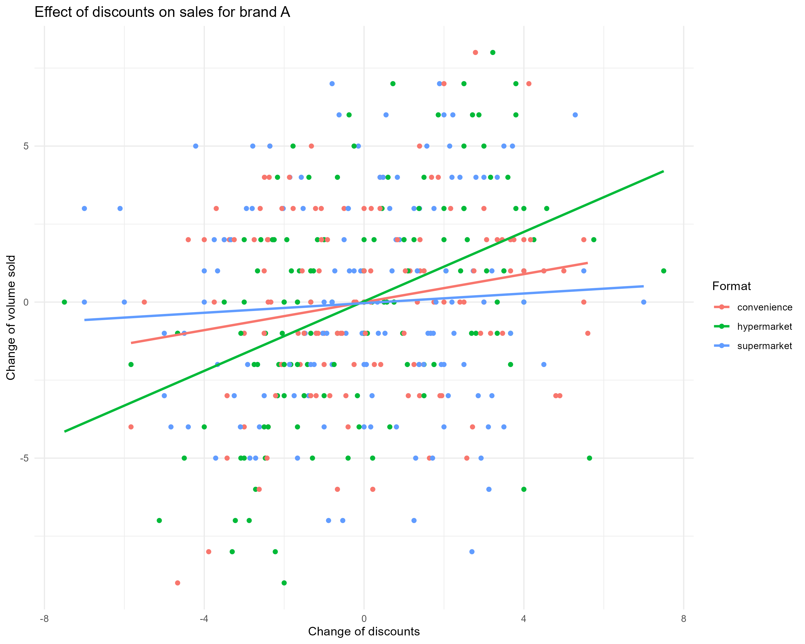
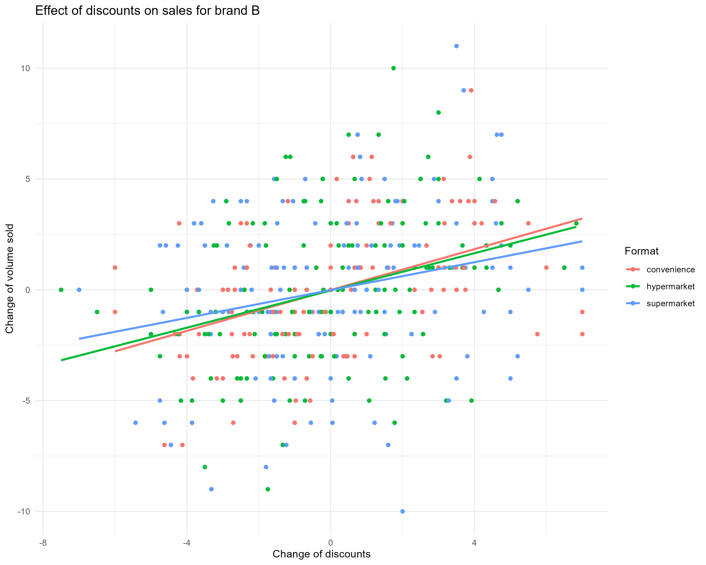
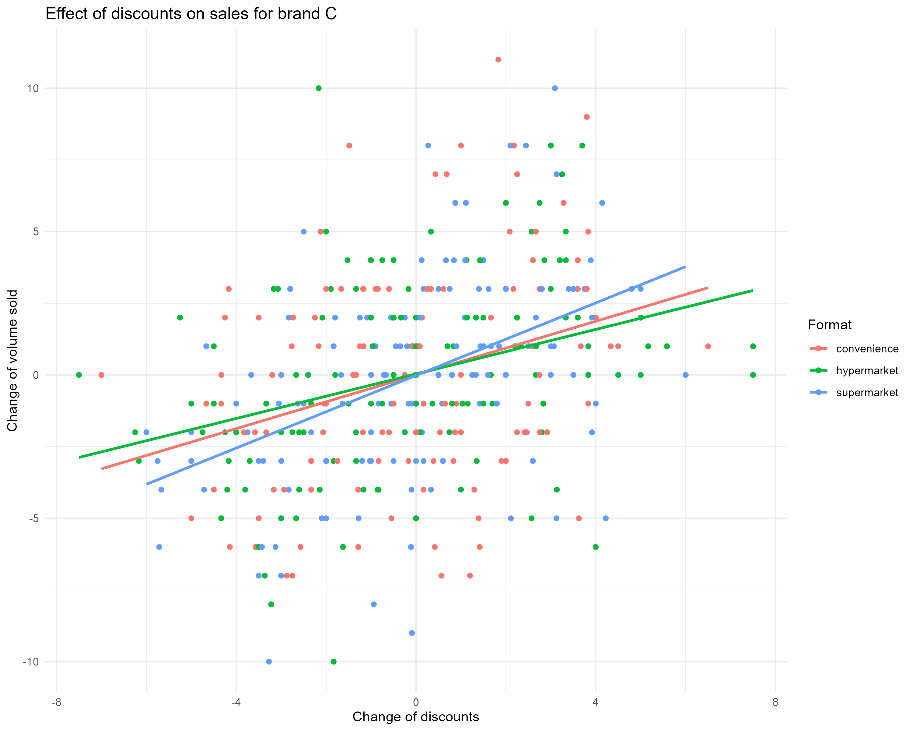
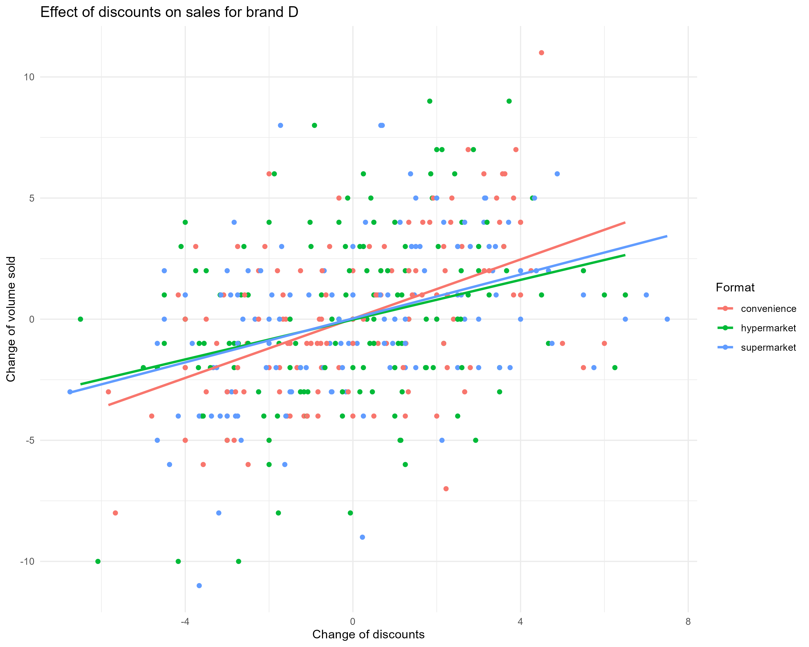
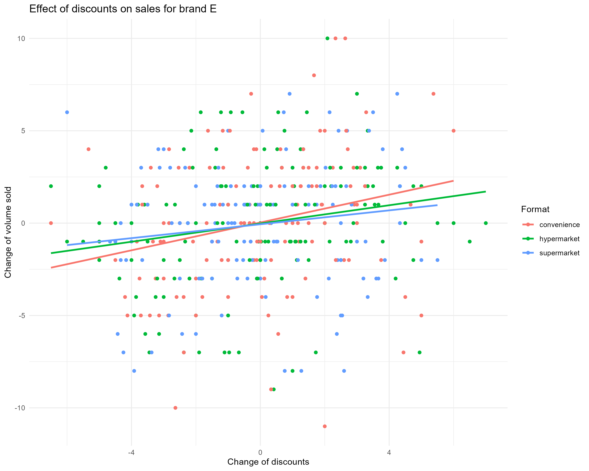
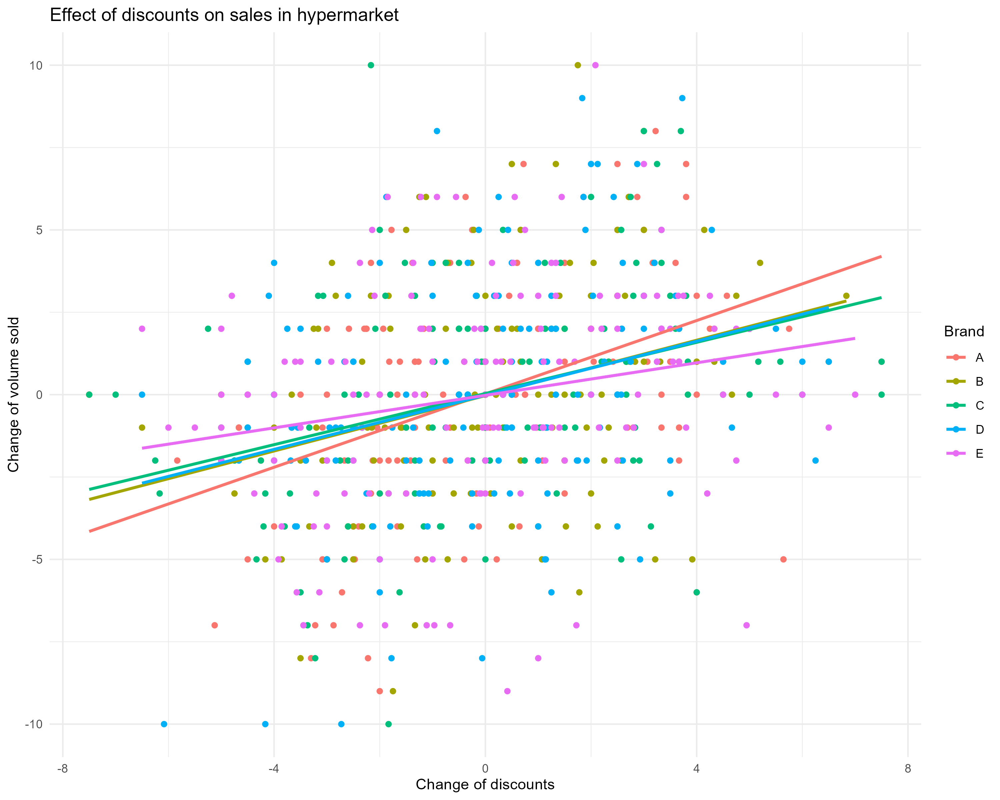
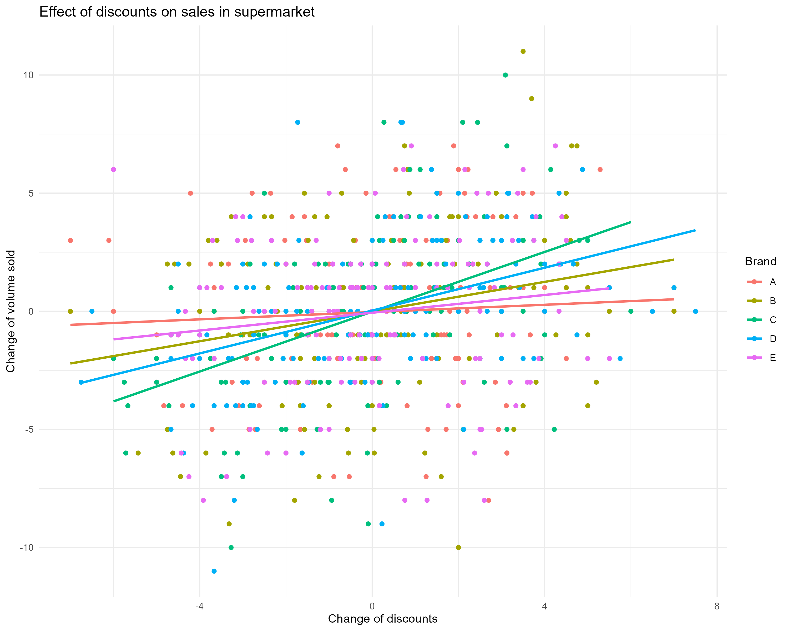
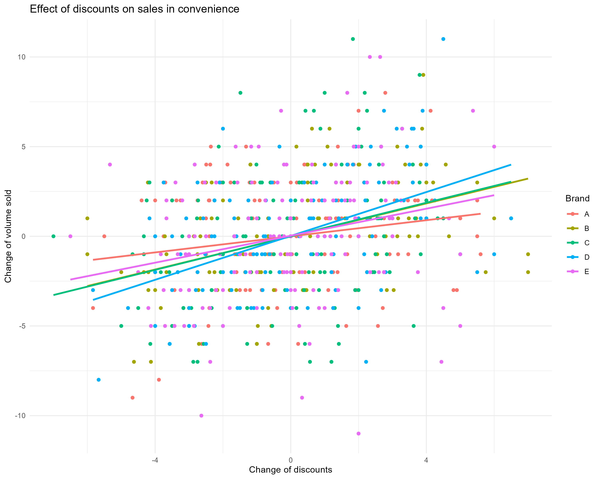
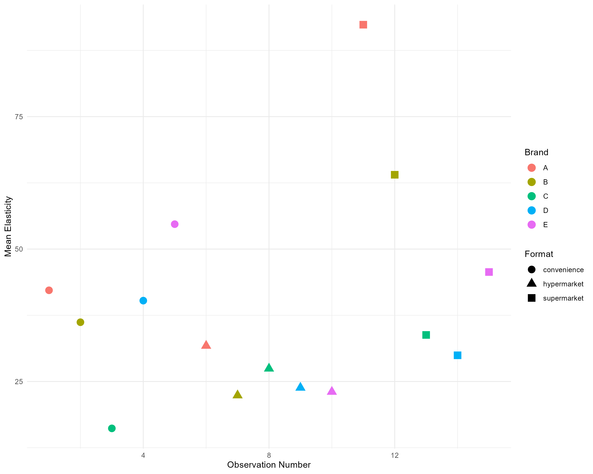

```{r setup, include=FALSE}
knitr::opts_chunk$set(echo = TRUE)
```


\section{\centering Project Summary} 
Most quantitative research papers model the effect of price promotions as the effect of changes in the final retail price while consumer behavior research suggests the potential framing phenomena in which customers can evaluate retail price and discounts differently. By taking this behavioral assumption in the sales-response model, we can estimate the discounts’ elasticities apart from price elasticities and investigate its systematic drivers from brand factors, category factors and store formats using second-stage regression. Using replicable simulated data (as I cannot share an actual data), I attempted to show that discounts are not equally effective across brands, categories and store format and I can estimate their differential effects.

\section{\centering Table of Contents}
- Model-Free Evidence: 
  - Data explonatory analysis of plausible relationship between brands' sales and discounts across store formats
- First-Stage Analysis: 
  - Estimated discounts elasticity for each brand
- Second-Stage Analysis: 
  - Estimated determinants of store format and brand characteristics on discounts elasticity

\newpage

\section{Model-Free Evidence}

- We explore relationship between brands' sales and offered discounts by simple plotting.







- We further plot the relationship between brands' sales and offered discounts across different store formats (i.e., hypermarket, supermarket and convenience store)







\newpage
\section{First-Stage Analysis}
We estimate discount elasticity across brands, categories and formats by employing an error-correction specification (Datta, van Heerde, Dekimpe, & Steenkamp, 2022) as our sales-response model;
\begin{align*}
\Delta sales_{i,j,k,t} =\ &\beta_{0i,j,k} + \beta_{1i,j,k}\Delta RegPrice_{i,j,k,t} - \beta_{1'i,j,k}\Delta Discounts_{i,j,k,t} \nonumber \\
&+ \beta_{2i,j,k}\Delta LineLength_{i,j,k,t} \nonumber + \beta_{3i,j,k}\Delta CompPrice_{i,j,k,t} \nonumber \\
&+ \beta_{4i,j,k}\Delta CompLineLength_{i,j,k,t} \nonumber \\
&+ \gamma_{i,j,k}[Sales_{i,j,k,t-1} \nonumber \\
&\quad - \beta_{5i,j,k}(\Delta RegPrice_{i,j,k,t-1} - \Delta Discounts_{i,j,k,t-1})] \nonumber \\
&- \beta_{6i,j,k}\Delta LineLength_{i,j,k,t} \nonumber + \beta_{7i,j,k}Holiday_{t} + \varepsilon_{i,j,k}
\end{align*}
where $\Delta X_{t} = X_{t} - X_{t-1}$ and the immediate effect of discounts is captured by $\beta_{1'i,j,k}$

We want to compare the discount effectiveness ($\beta_{1'i,j,k}$) across brands, categories and formats, we need to control for scale differences. Thus, we convert this unit effectiveness of discounts into percentage elasticities at mean $(\eta_{i,j,k})$ by multiplying it with the ratio of the average weekly brand sales $i$ in category $j$ in store format $k$ to its average weekly discounts offered (Srinivasan et al., 2004).

\begin{equation*}
\eta_{i,j,k} = \frac{\beta_{1'i,j,k} \times Discounts_{i,j,k}}{Sales_{i,j,k}} \times 100
\end{equation*}


We calculate discount elasticities for short term effect by normalizing with brand sales and plot:


\newpage
\section{Second-Stage Analysis}
To see how brand factors, category factors and store formats influence discount effectiveness, we estimate discounts elasticities at mean $\eta_{i,j,k}$ with respect to brand factors, category factors and store formats. The model for discount elasticity of brand i in category j in store format k is:
\begin{align*}
    \eta_{i,j,k} =\ & \delta_0 + \delta_1 \text{BrandDiscountDepth}_{i,j,k} + \delta_2 \text{BrandDiscountBreadth}_{i,j,k} \nonumber \\
    & + \delta_3 \text{Frequency}_{i,j,k} + \delta_4 \text{PrivateLabel}_{i,j} \nonumber \\
    & + \delta_5 \text{CatDiscountDepth}_{j,k} + \delta_6 \text{CatDiscountBreadth}_{j,k} \nonumber \\
    & + \delta_7 \text{CatDiscProportion}_{j,k} + \delta_8 \text{CatMarketComp}_{j,k} \nonumber \\
    & + \delta_9 \text{Format}_{k}
\end{align*}

The estimate result from aforementioned regression is:

```{r secondstage, echo=FALSE}
secondstage_result <- readRDS("../../gen/secondstage/secondstage_ls.rds")
print(summary(secondstage_result))
```

